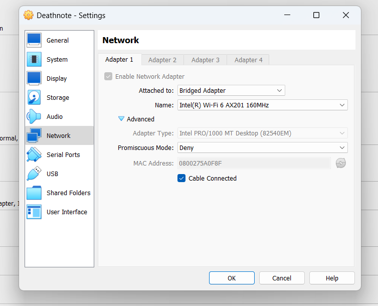

# Death Note VulnHub Walkthrough

## 🧠 Introduction

This penetration test was conducted on a vulnerable machine named **Death Note**, hosted on the VulnHub platform. The goal was to identify and exploit vulnerabilities to gain root access, simulating a real-world attack scenario.

---

## 🛠️ Methodology

Tools used:
- Netdiscover
- Nmap
- /etc/hosts
- WPScan
- Hydra
- Wget
- CyberChef

---

## 🔍 Scanning & Enumeration

### Step 1: Checking MAC Address
- Set up the lab environment and check the MAC address of the target VM.  


### Step 2: Discovering IP Address
- Use `Netdiscover` to find the target's IP in the network.  
📸 *Image 2*

- Verify connectivity with `ping`.  
📸 *Image 3*

### Step 3: Nmap Port Scan
```bash
nmap -A <target-ip>

