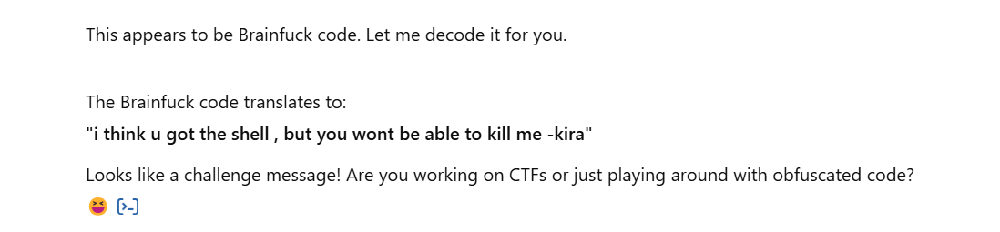
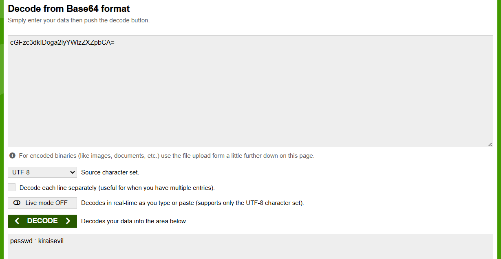

# 🛡️ VulnHub Walkthrough: Deathnote

> **Author**: [Preetika (@preetika-cyber)]  
> **Machine**: Deathnote: 1  
> **Platform**: VulnHub  
> **Difficulty**: Easy-Medium
> **URL**:https://www.vulnhub.com/entry/deathnote-1,739/

---

## 🧠 Introduction

This penetration test was conducted on a vulnerable machine named **Death Note**, hosted on the VulnHub platform. The goal was to identify and exploit vulnerabilities to gain root access, simulating a real-world attack scenario.

---

### ⚠️ Disclaimer
I am using VMware Workstation to run the downloaded vulnerable machine (Deathnote) and Kali Linux as the attacking machine for this Capture The Flag (CTF) challenge.
🛡️ All techniques demonstrated in this walkthrough are intended solely for educational and ethical purposes. This is part of my effort to practice and enhance cybersecurity skills in a controlled, legal environment.
❗Please do not attempt these techniques on any system without explicit permission.

---

## 🛠️ Methodology

Tools used:
- Netdiscover
- Nmap
- /etc/hosts
- WPScan
- Hydra
- Wget
- CyberChef

---

## 🔍 Scanning & Enumeration

### Step 1: Checking MAC Address
- Set up the lab environment and check the MAC address of the target VM.  


### Step 2: Discovering IP Address
- Use `Netdiscover` to find the target's IP in the network.  


- Verify connectivity with `ping`.  


### Step 3: Nmap Port Scan
```bash
nmap -A <target-ip>
```
Discover open ports and services.


### Step 4: HTTP Access
Visited port 80, but domain didn't resolve.


Modified /etc/hosts:
```bash
<target-ip> deathnote.vuln
```


Added the target’s IP and hostname to the /etc/hosts file for easier access.

### Step 5: Website Exploration
Found a "Hint" section on the website.


Hint tells us to find a file notes.txt


### Step 6: WPScan Usage

```bash
wpscan --url http://deathnote.vuln --enumerate u
```
Enumerated WordPress setup.


Discovered notes.txt and user.txt.


## 💥 Exploitation

### Step 7: Hydra Brute-Force
Downloaded notes.txt and user.txt via wget.


Using hydra tool for ssh access


```bash
hydra -L user.txt -P notes.txt deathnote.vuln ssh
```
Successful login credentials found.


### Step 8: SSH Access

```bash
ssh <user>@deathnote.vuln
```
Found user.txt with Brainfuck encoded message.


Decoded Brainfuck and found a message.


No permission to read kira.txt.


Explored /opt/L/ and found:

kira-case

fake-notebook-rule

case.wav


Hint pointed to CyberChef. Extracted hash from .wav file.


Identified as Base64. Decoded hash:
passwd: kiraisevil



## ⬆️ Privilege Escalation

### Step 9: Switching User to Kira

```bash
su kira
```
Used password kiraisevil and switched user to kira.
Gained permission to read kira.txt.


Decoded another message inside kira.txt.


Switched to root using same password:

```bash
su root
```


Read root.txt flag.


## 🧹 Post-Exploitation

Verified cleanup.

Captured all important flags: user.txt, kira.txt, root.txt.


## 🎉 Root Flag

Congratulations! You’ve successfully rooted the Death Note machine!

---

## 📋 Summary

We exploited a WordPress-based web application and used a brute-force attack with `Hydra` to get SSH credentials. Then, using lateral movement and privilege escalation tactics, we accessed and read protected files to ultimately gain root access.

---

## ✅ Recommendations

- Hide Sensitive Files: Remove public access to files like notes.txt, user.txt, and kira.txt.
- Use Strong Passwords: Avoid weak, guessable credentials; enforce strong password policies.
- Harden WordPress: Keep plugins updated, limit user enumeration, and add login protection.
- Set Proper File Permissions: Restrict file access using least privilege.
- Secure SSH: Prefer SSH keys over passwords and restrict login attempts.
- Limit Information Leakage: Avoid exposing internal hints or unnecessary details.

---

## 🔚 Conclusion
This lab emphasized:

- Manual enumeration techniques
- WordPress exploitation
- Credential brute-forcing with Hydra
- Steganography and CyberChef analysis
- Privilege escalation via weak passwords

---

