# 🛡️ VulnHub Walkthrough: Cybersploit

> **Author**: [Preetika (@preetika-cyber)]  
> **Machine**: Cybersploit-CTF  
> **Platform**: VulnHub  
> **Difficulty**: Easy-Medium
> **URL**:https://www.vulnhub.com/entry/cybersploit-1,506/

---

## 📖 Introduction

This walkthrough documents the exploitation of the *Cybersploit-CTF* machine on VulnHub. The objective was to escalate privileges from a basic user to root and capture three hidden flags. The attack was carried out using Kali Linux as the attacker machine.

---

### ⚠️ Disclaimer
I am using VMware Workstation to run the downloaded vulnerable machine (Cybersploit) and Kali Linux as the attacking machine for this Capture The Flag (CTF) challenge.
🛡️ All techniques demonstrated in this walkthrough are intended solely for educational and ethical purposes. This is part of my effort to practice and enhance cybersecurity skills in a controlled, legal environment.
❗Please do not attempt these techniques on any system without explicit permission.

---

## 🛠️ Tools Used

- `nmap` – for port scanning
- `dirb` – for web directory brute-forcing
- `browser dev tools` – for viewing source code
- `hash-identifier` – for identifying encoded strings
- `ssh` – for remote access
- `gcc` – for compiling local privilege escalation exploit
- `cat` – for reading flag files

---
## 🔍 Scanning

### 🔎 Step 1: Network Discovery

First, we identified the IP address of the target using:

```bash
ip a
```
Then, scanned the target using Nmap:

```bash
nmap -sC -sV -oN nmap/nmap_scan.txt <target-ip>
```
Findings:

Port 22: OpenSSH
Port 80: Apache HTTP Server

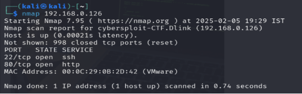

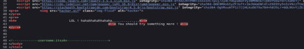

## 🧭 Enumeration

### 🌐 Step 2: Web Source Inspection

Visited the IP in a browser and viewed the page source.

Found username: itsskv

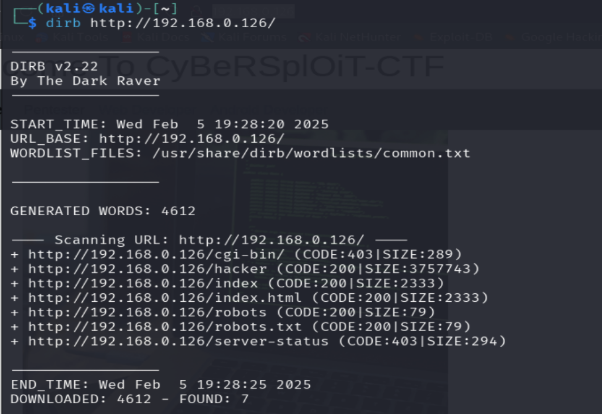

### 📂 Step 3: Directory Bruteforce

Ran dirb to enumerate web directories:

```bash
dirb http://<target-ip>
```
Found Directories:

/robots.txt
/admin
Others...

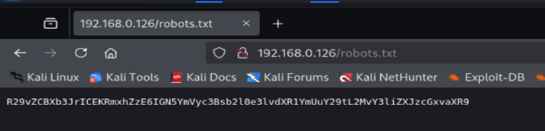

## 🔓 Exploitation

### 🕵️ Step 4: robots.txt & Hash Discovery

Accessed /robots.txt:

```bash
http://<target-ip>/robots.txt
```
Discovered a hash value.


### 🔐 Step 5: Hash Identification & Decoding

Used hash-identifier to determine hash type:

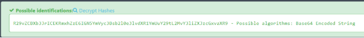
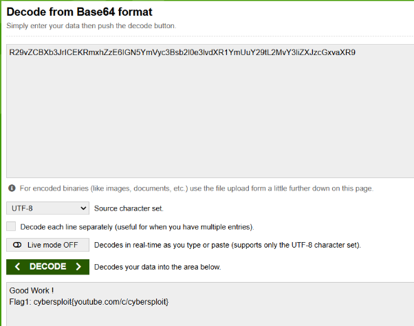

## 🧪 SSH Exploitation

### 🧬 Step 6: SSH Login Using Flag 1

Used the previously found credentials:

Username: itsskv
Password: Flag 1

```bash
ssh itsskv@<target-ip>
```

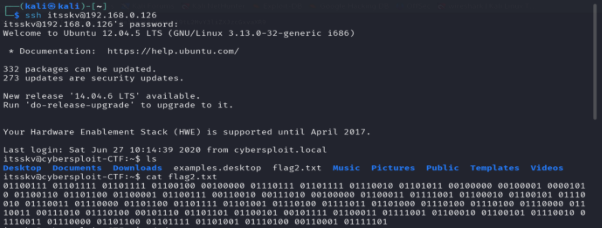

## ⚙️ Privilege Escalation

### 🔍 Step 7: Finding Second Flag

Located flag2.txt with binary data.


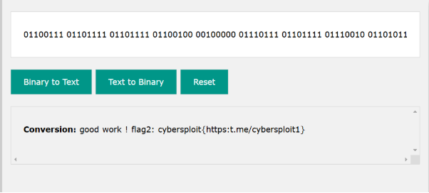

### ⚔️ Step 8: Compile Exploit

Downloaded a C language exploit from Exploit-DB, saved it as exploit.c, and compiled:

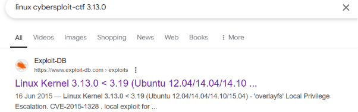

Exploit Database Linux Kernel 3.13.0 < 3.19 (Ubuntu 12.04/14.04/14.10/15.04) - 'overlayfs' Local Privilege Escalation :https://www.exploit-db.com/exploits/37292

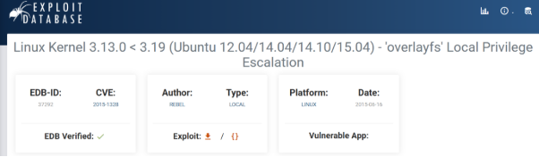

```bash
touch code.c && nano code.c
gcc code.c -o exploit.c
chmod +x exploit.c  # changes permission for exploit.c file
./exploit.c  # runs the file
```
Discovered finalflag.txt

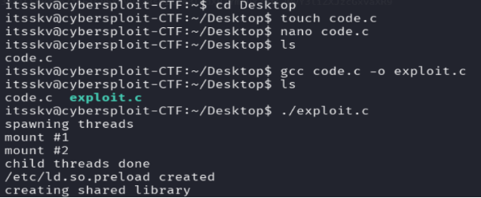

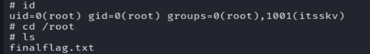


## 🧪 Post-Exploitation

### 🔓 Step 9: Root Access & Final Flag

After privilege escalation, switched to root and viewed finalflag.txt:

```bash
cat /root/finalflag.txt
```
Flag 3 Acquired

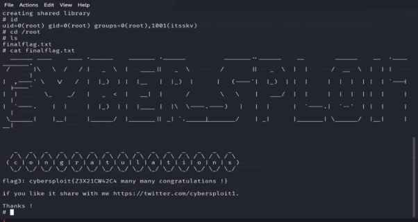

## 🏁 Summary

# Successfully:

- Enumerated the web interface to find usernames and hidden files.
- Decoded a Base64 hash to retrieve the first flag.
- Used the first flag as an SSH password to access the machine.
- Converted binary to retrieve the second flag.
- Escalated privileges using a compiled local exploit to access the third flag.

## 📌 Recommendations

- Remove sensitive information from publicly accessible files like /robots.txt.
- Avoid reusing easily guessable credentials.
- Keep systems updated to avoid known privilege escalation exploits.


