# 🛡️ VulnHub Walkthrough: Deathnote

> **Author**: [Preetika (@preetika-cyber)]  
> **Machine**: Tr0ll: 1
> **Platform**: VulnHub  
> **Difficulty**: Beginner ; Type: boot2root
> **URL**:https://www.vulnhub.com/entry/tr0ll-1,100/

---

## 🧠 Introduction

This penetration testing report documents the exploitation process of the Tr0ll 1 virtual machine, available on VulnHub. Designed as a beginner-level challenge, Tr0ll 1 emphasizes the importance of thorough enumeration and highlights common pitfalls through intentional misdirection. The goal of this assessment is to gain root access by identifying and exploiting various system vulnerabilities.This penetration test was conducted on a vulnerable machine named tr0ll 1, hosted on the VulnHub platform.

---

### ⚠️ Disclaimer
I am using VMware Workstation to run the downloaded vulnerable machine (Tr0ll: 1) and Kali Linux as the attacking machine for this Capture The Flag (CTF) challenge.
🛡️ All techniques demonstrated in this walkthrough are intended solely for educational and ethical purposes. This is part of my effort to practice and enhance cybersecurity skills in a controlled, legal environment.
❗Please do not attempt these techniques on any system without explicit permission.

---

## 🛠️ Methodology

Tools used:
-	Netdiscover
-	Nmap
- Wget
-	Wireshark
-	Hydra
-	Exploit database
  
---

### Step 1: 🔍 Reconnaissance and Scanning

First we got the MAC addresses of tr0ll VulnHub machine from setting and ran the command netdiscover to get the IP address  
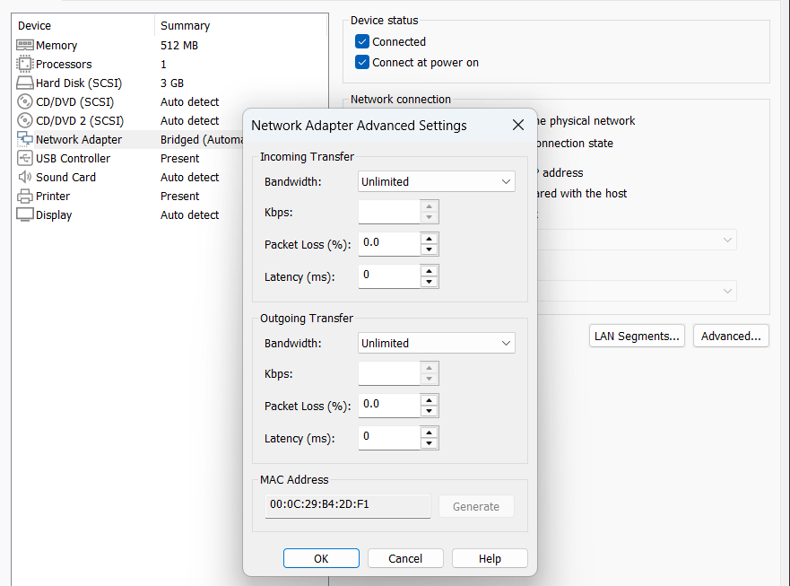
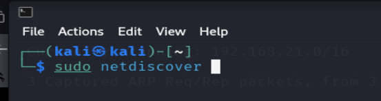
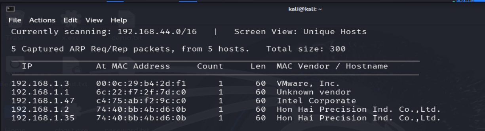

We got the IP address of tr0ll machine i.e. `192.168.1.3`

Now, scanning the open ports with `nmap` scan  
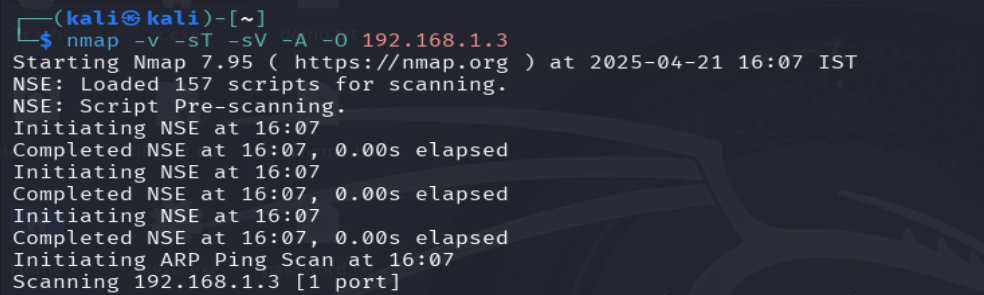
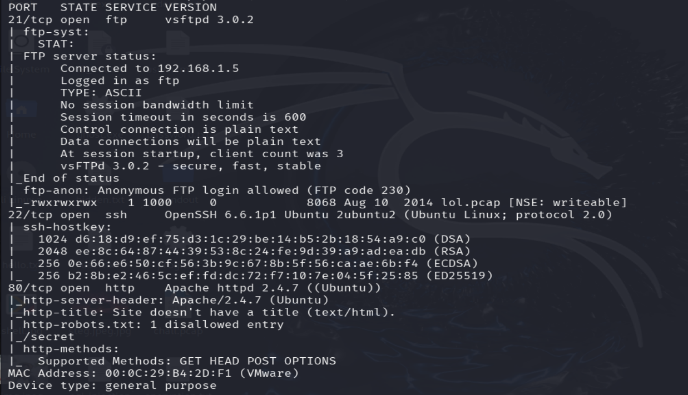

Here we can see that HTTP (80), FTP (21), SSH (22) ports are open:

- **Port 21/FTP Open**
  - Anonymous Login Enabled
  - `lol.pcap` file on the FTP server (interesting!)
- **Port 22/SSH Open**
  - OpenSSH 6.6.1p1
- **Port 80/HTTP Open**
  - Apache 2.4.7
  - `robots.txt` with 1 entry: `/secret`

OS: Linux (Ubuntu, as seen on the webserver and SSH)

---

### Step 2: 🧭 Enumeration

Now, first starting with the HTTP (80) port to see if we there is anything in `/secret`  
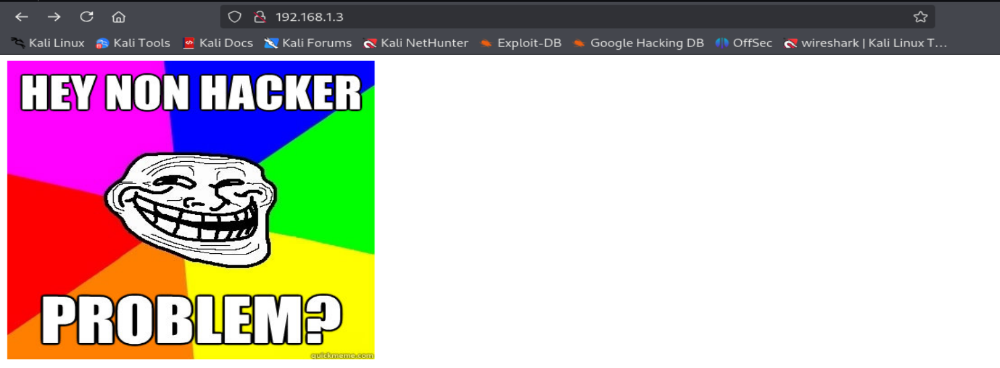
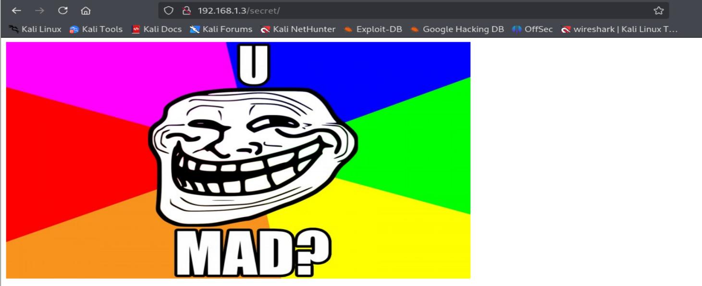

There is nothing useful in `/secret`. Now exploring FTP (21) port. As we know that FTP allows anonymous login and there is a `lol.pcap` file on the FTP server. Login as anonymous.

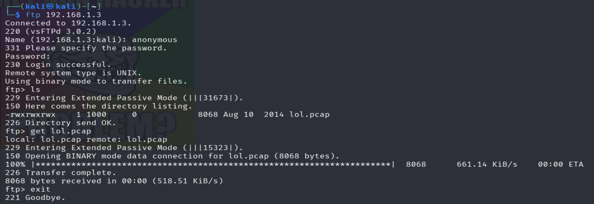

Downloaded the `lol.pcap` file with `wget` command  
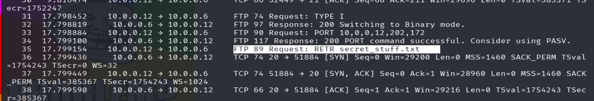

Here in `lol.pcap` file, we can see there is something `secret_stuff.txt`. So open the file in Wireshark  
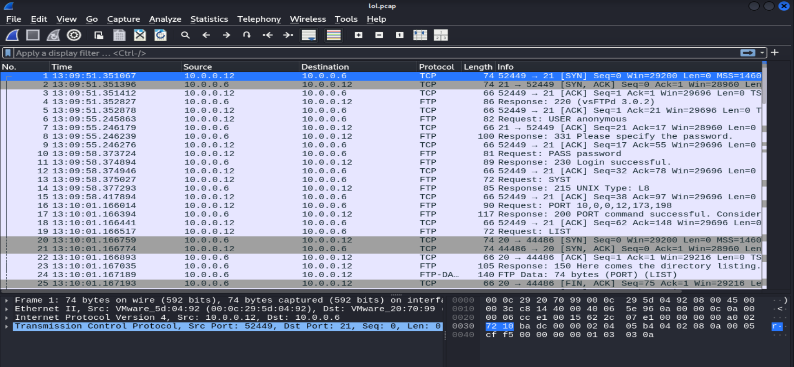

Searching `ftp-data` we got the `secret_stuff.txt`
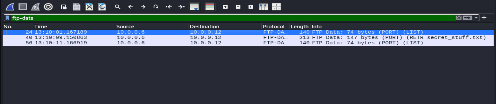
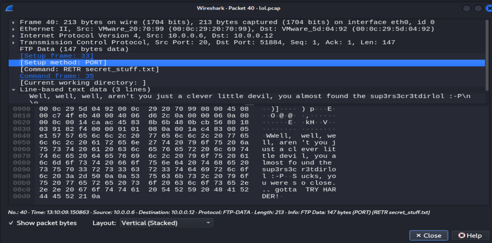

In this message it says you almost found `sup3rs3cr3tdirlol` — this is likely useful.
It is a directory. Now, in this directory, we got a file named `roflmao`  
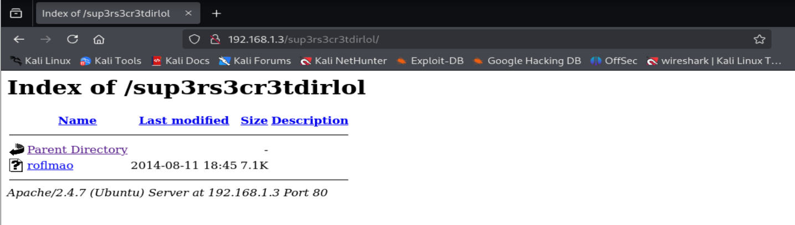

Downloaded the `roflmao` file
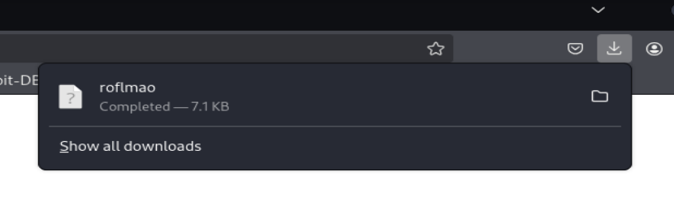

The file named `roflmao` has been downloaded to the Kali machine to be checked.  
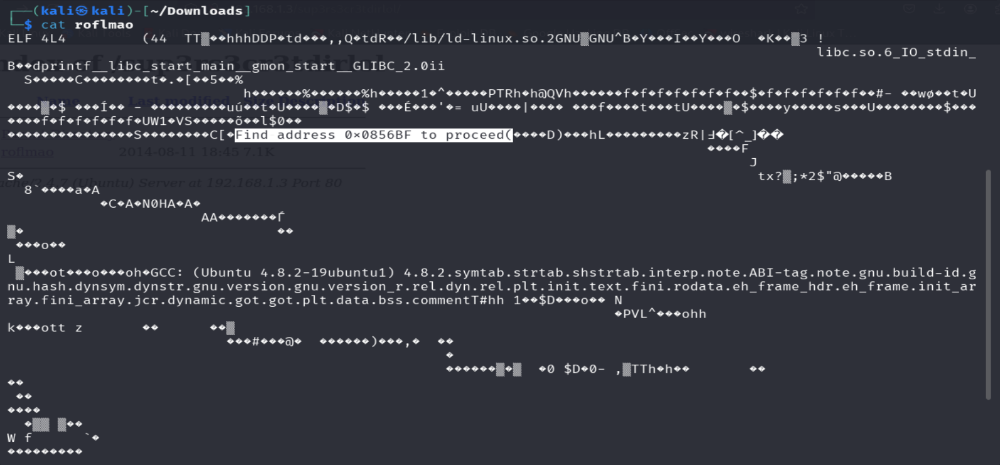

Checking the `roflmao` file we got `0x0856BF` — maybe it is also a directory.

Similarly, when the `0x0856BF` value detected in the previous stage was given as a path on port 80, the result was obtained as follows:  
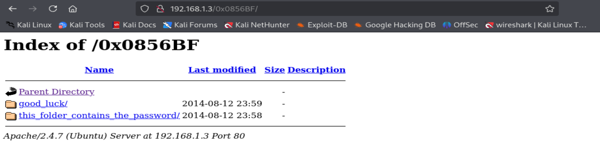
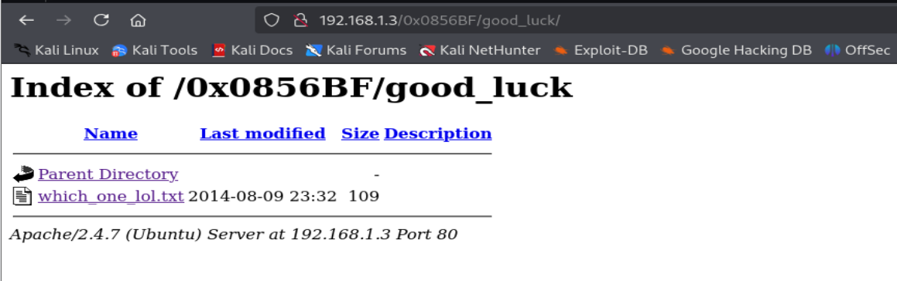
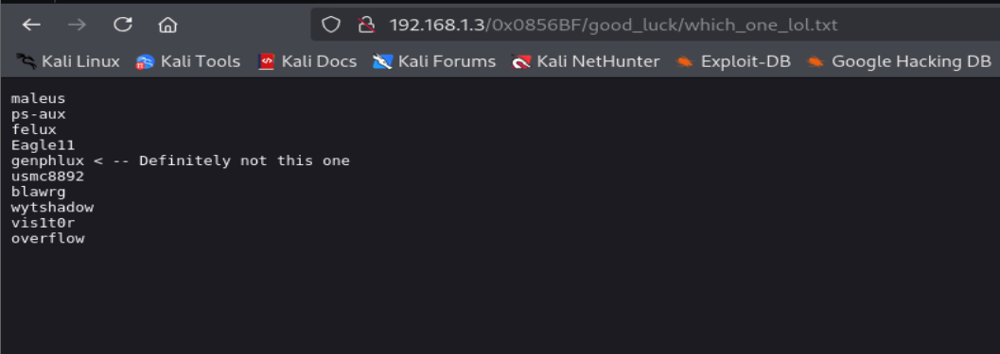
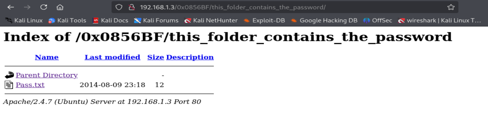
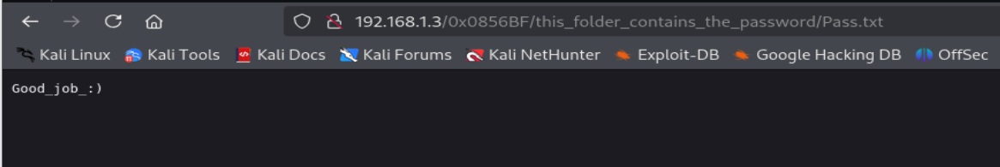

Downloaded the files `Pass.txt` and `which_one_lol.txt` and renamed to `password.txt` and `username.txt`
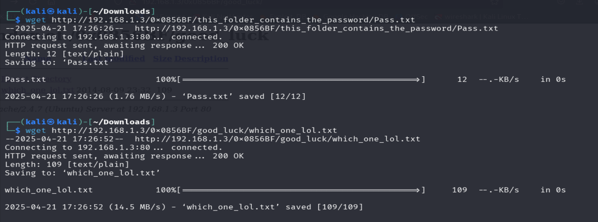

Now, making some changes in `password.txt` and `username.txt` files  
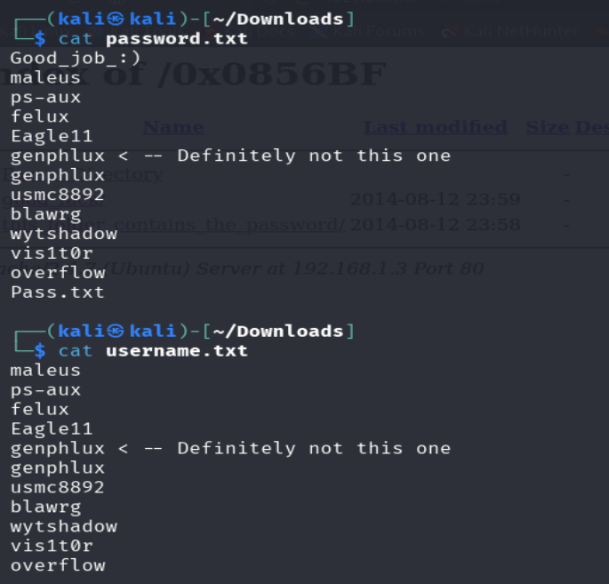

---

### Step 3: 💥 Exploitation

Using Hydra tool for brute-forcing SSH  
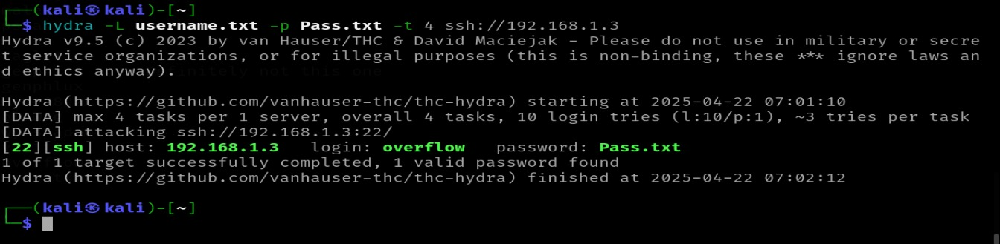

In the SSH brute force attack performed with Hydra, `overflow:Pass.txt` username and password information was detected.
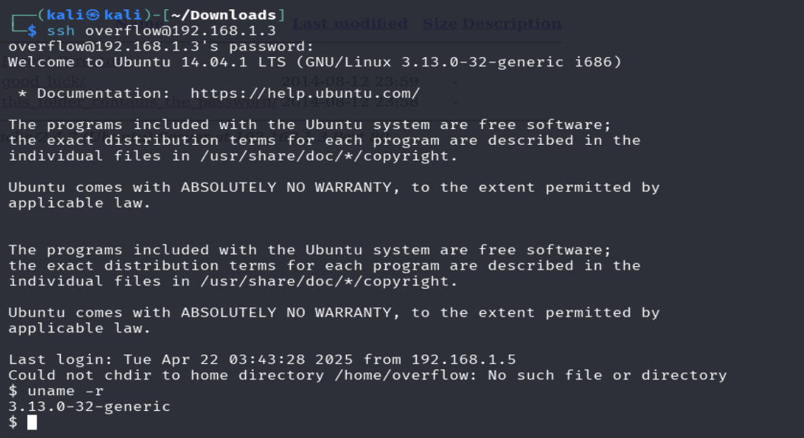

Now, we can see that the kernel version is `3.13.0-32`  
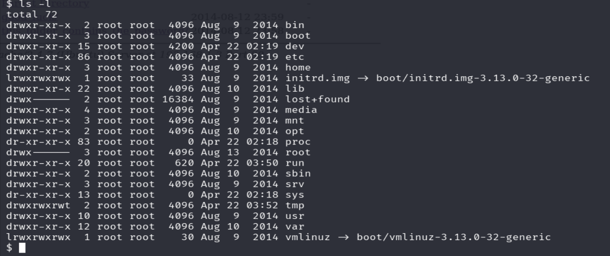
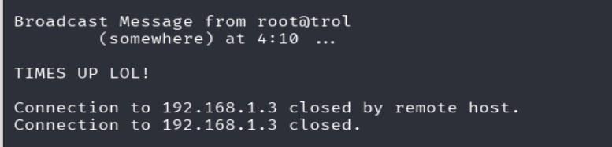

After typing around a bit, I noticed we don’t have a lot of rights on the system. It also seems that you get kicked out of the SSH session if you are connected for too long.

---

### Step 4: ⬆️ Privilege Escalation

Searching exploit for kernel version `3.13.0-32-generic`  
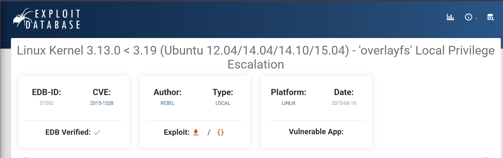

Using Exploit Database for privilege escalation
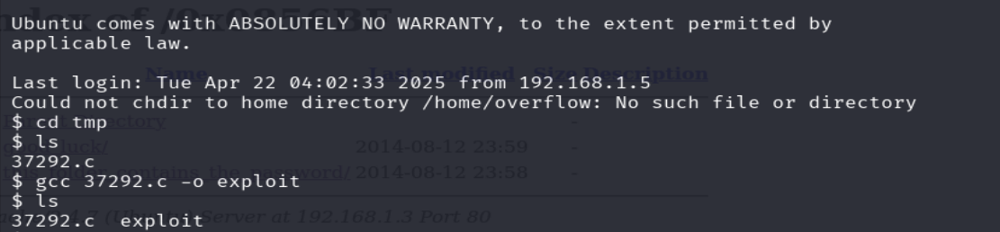

Here we downloaded the exploit, compiled it, and ran the exploit  
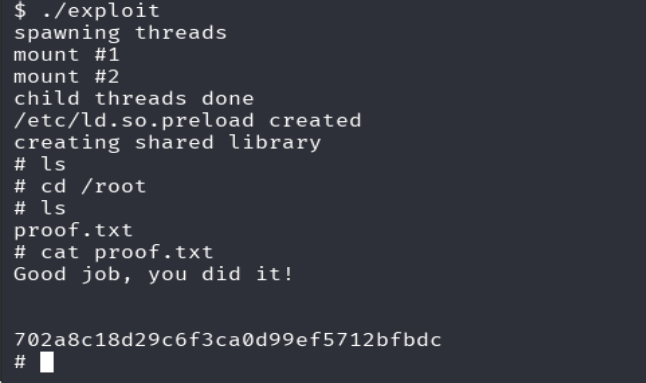

Finally, we got the root flag.  

---

## 🧾 Summary

The exploitation of the *Tr0ll 1* machine involved a combination of enumeration, file analysis, and privilege escalation techniques. Initial reconnaissance revealed open FTP, SSH, and HTTP services. FTP allowed anonymous login, which provided access to a `.pcap` file. Analyzing this file in Wireshark revealed a hidden directory name, leading to a sequence of directories and files via the HTTP service.

By systematically exploring these clues, we uncovered username and password files. After refining the data, a successful brute-force SSH login was performed using Hydra. Post-authentication, we identified a potentially vulnerable kernel version (`3.13.0-32`). A local privilege escalation exploit from Exploit-DB targeting this kernel was used, allowing us to gain root access and retrieve the final flag.

---

## ✅ Recommendation

- Disable anonymous FTP access to prevent information leakage.
- Avoid storing sensitive data in plaintext or public-facing directories.
- Regularly update system packages and kernel to patch known vulnerabilities.

---

